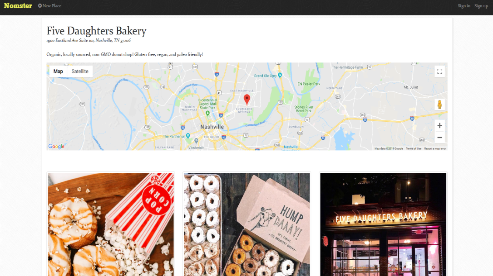

# README

# Nomster

## Introduction

> A Yelp clone that integrates with the Google Maps API and includes features like user comments, star ratings, image uploading, and user authentication.

## Technologies

> * Ruby on Rails framework
> * HTML
> * CSS
> * Bootstrap

## Deployment

> https://nomster-kayla-anderson.herokuapp.com/